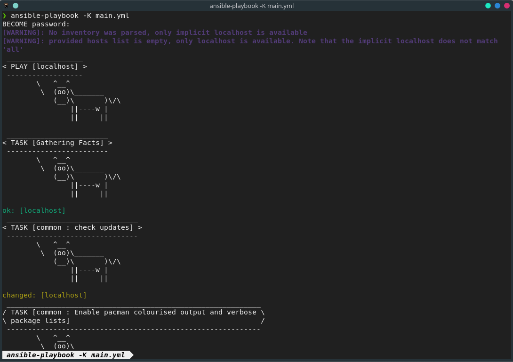
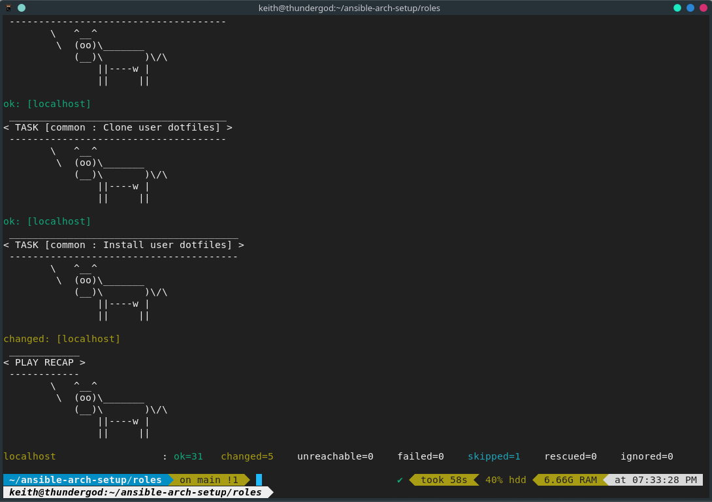
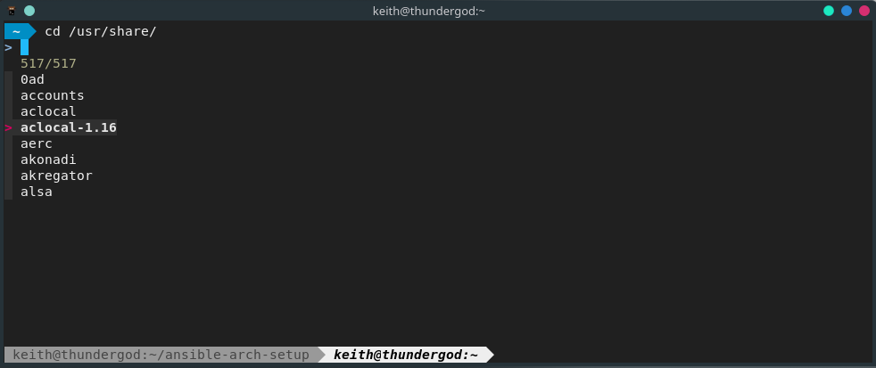
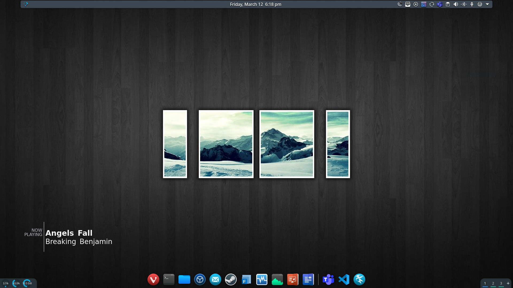
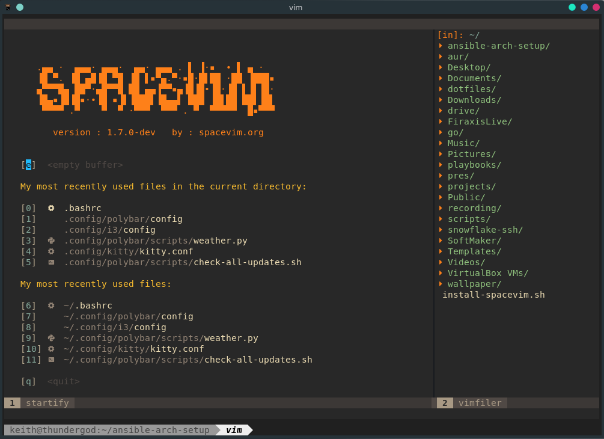
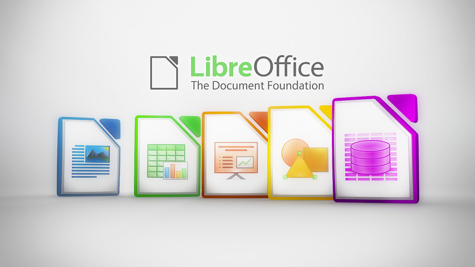
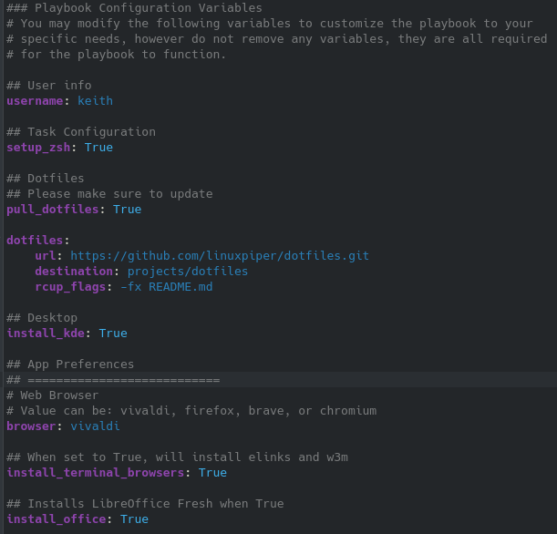

- [Ansible Arch Linux Setup Project](#ansible-arch-linux-setup-project)
  - [Quick Start](#quick-start)
    - [Step 1: Clone this repository](#step-1-clone-this-repository)
    - [Step 2: Install Ansible](#step-2-install-ansible)
    - [Step 3: Update your system (optional)](#step-3-update-your-system-optional)
    - [Step 4: Update the username variable (critical)](#step-4-update-the-username-variable-critical)
    - [Step 5: Run the Playbook](#step-5-run-the-playbook)
    - [Step 6: Reboot](#step-6-reboot)
  - [What does it do for me?](#what-does-it-do-for-me)
    - [Main Apps and Configs](#main-apps-and-configs)
      - [zsh with powerline10k, lsd, and Oh My Zsh!](#zsh-with-powerline10k-lsd-and-oh-my-zsh)
      - [Kitty (Terminal)](#kitty-terminal)
      - [KDE Plasma](#kde-plasma)
      - [SpaceVim](#spacevim)
      - [LibreOffice (Fresh)](#libreoffice-fresh)
      - [Others](#others)
  - [What does it *not* do for me?](#what-does-it-not-do-for-me)
  - [Customization](#customization)
      - [1. Variables](#1-variables)
        - [Dotfiles](#dotfiles)
      - [2. YML Files](#2-yml-files)
  - [WARNING](#warning)
  - [FAQ](#faq)
      - [Does this work with [insert distro here]?](#does-this-work-with-insert-distro-here)
      - [Will this break my machine?](#will-this-break-my-machine)
      - [It failed at some step, why?](#it-failed-at-some-step-why)
      - [Can I safely rerun the playbook?](#can-i-safely-rerun-the-playbook)
      - [My Plasma desktop doesn't look like the screenshot! Why?](#my-plasma-desktop-doesnt-look-like-the-screenshot-why)
      - [I made it better, do you take pull requests?](#i-made-it-better-do-you-take-pull-requests)
      - [I don't want KDE Plasma, can I skip it?](#i-dont-want-kde-plasma-can-i-skip-it)
      - [I don't like Vivaldi, can I change it?](#i-dont-like-vivaldi-can-i-change-it)
      - [How do I include my own dotfiles?](#how-do-i-include-my-own-dotfiles)
      - [I have a question, how can I contact you?](#i-have-a-question-how-can-i-contact-you)
      - [How can I support the project?](#how-can-i-support-the-project)
      - [Where is the Code of Conduct?](#where-is-the-code-of-conduct)

# Ansible Arch Linux Setup Project 
The Ansible Arch setup project aims to make your life easier when setting up a new environment with Arch Linux by automating a number of configurations and installations. Additionally, the project can assist in keeping your existing environment consistent and updated the way you like it!

You can run the playbook as often or as many times as you'd like to keep your desktop environment(s) sync'd and configured the way you want. Ansible is *idempotent*, so it's built for re-running without breaking anything.

*Pro Tip: if you want those lovely cows instead of the boring standard Ansible output, install cowsay before running the playbook*

## Quick Start

I highly recommend you continue reading the sections below before proceeding with the quick start, but if you just want to get up and running, below are the **minimum** steps required.

It's assumed the first time you run the playbook you're doing it on a fairly minimal Arch installation, though it's certainly not required. The project has been tested thoroughly on a minimal Manjaro XFCE installation as well as ArcoLinux, but should work fine on any Arch or Arch based distro.

### Step 1: Clone this repository
`git clone --recurse-submodules https://github.com/linuxpiper/ansible-arch-setup.git`

***NOTE: You must use --recurse-submodules for this to work***

### Step 2: Install Ansible
`sudo pacman -Sy ansible`

### Step 3: Update your system (optional)
`sudo pacman -Syu`

If you are running this project on a brand new, fresh Arch install, you can go ahead and update your system via pacman prior to running the playbook. You don't have to, but expect that the playbook will take a little longer when running for the first time since it will do the updates.

### Step 4: Update the username variable (critical)

Open up `roles/common/vars/main.yml` and change the `username` value to the appropriate user name for your system.

You absolutely should review all of the vars config file and modify it to your liking, however changing the `username` variable to match the username you are running this project for is the minimum you need to do.

If you want to use your own dotfiles, change the `dotfiles.url` value in the same config file to point to a git repo of your choosing.

### Step 5: Run the Playbook
While in the `roles` directory, execute:

`ansible-playbook -K main.yml`

The `-K` parameter is equivilent to `--ask-become-pass` and is used to collect your password for items requiring `become` permissions. 

The playbook can take anywhere from 1 to 10 minutes or so depending on the speed of your machine and whether you chose to follow **Step 3**. It won't get stuck forever; be patient and wait for it to finish.

**Pro Tip:** *While you're waiting for the playbook to finish, think of all the things you **did not** have to do and praise yourself for using Linux. Maybe go grab a beer or something to celebrate your awesomeness.*

### Step 6: Reboot
Yay!

## What does it do for me?
A lot! We'll get to the specifics, but what's more important is that even if you haven't used Ansible, you can easily follow along in the config files (.yml files) and tailor it to your liking. You don't need to be a programmer, devops engineer, or rocket scientist...it's really easy to customize.

Any time you set up a new machine running Arch or any flavor of Arch you can simply run this playbook to get your new machine up and running the way you like it. 

### Main Apps and Configs
#### zsh with powerline10k, lsd, and Oh My Zsh!

Level up your terminal with this zsh configuration! Informative powerline, beautiful theme colors, and incredibly productive. Also you look like a badass.

We also include a directory navigator you can use while typing at the command line.

#### Kitty (Terminal)

Included is the Kitty terminal which is a super fast, GPU accelerated terminal. It's preconfigured and optimized for zsh including zsh completions and colorization.

#### KDE Plasma

*desktop appearances will vary*

KDE Plasma is the most beautiful, productive desktop on the planet! A full KDE Plasma environment is set up and configured for you. 

#### SpaceVim

Spacevim is the most productive, beautiful customization of vim that you will ever come across. 

[Read more about SpaceVim](https://spacevim.org)

#### LibreOffice (Fresh)

LibreOffice is the de facto open source office suite. The latest and greatest is installed and kept fresh.

#### Others
No less important are all the other great apps that are deployed as part of the project, such as:

- VLC 
- tmux
- Terminal browsers (elinks and w3m)
- Your choice of graphical web browser (Vivaldi (default), Firefox, Chromium, etc.)
- yay for aur support
- micro text editor
- and more!

## What does it *not* do for me?
This playbook will not currently configure display drivers, kernels, specific mirrors, user groups, or other core tasks that could potentially nuke your system. I may add this as an additional, separate role later on but for now I've taken a fairly conservative route.

## Customization

There are two key areas for customizing your deployment.

#### 1. Variables
The file `roles/common/vars/main.yml` contains all of the main configuration variables to quickly customize what to install and how.

Simply change any variable to False if you'd like to skip that part of installation. 

##### Dotfiles
Your dotfiles can be pulled each time you run the ansible playbook by simply pointing the `dotfiles.url` key to a valid git URL.

Dotfiles are synced / managed using [rcm](https://github.com/thoughtbot/rcm) which comes from the AUR. If you disable AUR in the vars file  (`use_aur`)  you cannot pull your dotfiles without tweaking the `dotfiles.yml` file to exclude rcm.

#### 2. YML Files

Most yml files that customize app configuration can be found in `roles/common/tasks`. You can edit any existing yml file, or add your own and include it in the `main.yml` playbook.

## WARNING
*This project is in its early stages and is being refactored and optimized using Ansible and Linux best practices. Whilst it should be safe enough, it's up to you to review the playbook and packages being installed and configured before running it on your machine.*

## FAQ

#### Does this work with [insert distro here]?
Right now, only Arch Linux and Arch Linux derivatives are supported.

#### Will this break my machine?
It shouldn't, it will most likely make it awesome.

#### It failed at some step, why?
You could be missing a dependency or maybe you already have another version of the same package installed (e.g. micro-bin instead of micro-git). You can comment out that item from the yml file and re-run the playbook.

Feel free to open an issue on Github if you need a hand.

#### Can I safely rerun the playbook?
As often as you'd like. Just keep in mind that if you removed some packages after previously running the playbook, they will be reinstalled.

#### My Plasma desktop doesn't look like the screenshot! Why?
KDE Plasma has a million different config files spread out all over the place, and while I am considering adding a role to make the final plasma desktop look like mine, it's a huge amount of work to do it properly.

It's actually easier to just customize it how you want - that's one of the biggest benefits of KDE Plasma.

#### I made it better, do you take pull requests?
Please and thank you! :)

#### I don't want KDE Plasma, can I skip it?
Sure - just set `install_kde` to `False` in the `/roles/common/vars/main.yml` file.

#### I don't like Vivaldi, can I change it?
You bet - open up `/roles/common/vars/main.yml` and change `browser: vivaldi` to one of the following values: `firefox`, `brave`, or `chromium`.

#### How do I include my own dotfiles?
It's so easy! Open up `/roles/common/vars/main.yml` and look for the `dotfiles:` section. Change the `url` to point to your own git repository. It doesn't have to be on Github, just publicly accessible.

#### I have a question, how can I contact you?
The best place to ask questions is to just open an issue in the Github repo. However you can email me at linuxpiper@gmail.com

#### How can I support the project?
This project is useless without all of the great free and open software it installs and configures. Donate to one of them!

#### Where is the Code of Conduct?
We don't do that stuff here. Be a grown up.